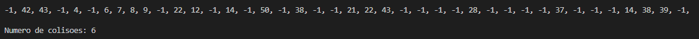

# Tabela Hash aberta dupla

 
 

 

 

A tabela hash dupla se diferencia de uma tabela hash normal no caso em que ele não possui tamanho fixo para que quando ela fica muita cheia possa ser aumentado o tamanho dela, outro diferencial dela é que ela possui duas caontas para definir aonde um valor vai ser posicionado, mais sobre em <a href="https://github.com/mpiress/HashTable#readme">HashTable</a>. Quando um valor é adicionado na tabela hash aberta dupla é feito o mod do valor com o tamanho da tabela(key) e o mod do valor gerado pleo mod anterior com o numero primo menor que a tamanho da tabela(offset), com este valores a posição em que o valor deve ser guardado, se a posição key já estiver vazia o valor é adicionado nela senão estiver vazia vai ser feito mod de key+offset com tamanho da tabela para achar outra posição onde o valor pode ser colocado, isto acontecerá até achar uma posição que estiver vazia. 

# Resultados

O resultados obtidos foram que houve 6 colisões, pelo fato de que a segunda posição calculada já pode ter um valor nela, com as seguintes 20 entradas:  14, 38, 8, 14, 9, 28, 37, 43, 6, 22, 21, 39, 42, 43, 12, 7, 22, 50, 38, 4.
   Imagem do resultado printado pelo código:

# Compilação e Execução

A tabela hash aberta dupla disponibilizada possui um arquivo Makefile que realiza todo o procedimento de compilação e execução. Para tanto, temos as seguintes diretrizes de execução:

| Comando                |  Função                                                                                           |
| -----------------------| ------------------------------------------------------------------------------------------------- |
|  `make clean`          | Apaga a última compilação realizada contida na pasta build                                        |
|  `make`                | Executa a compilação do programa utilizando o gcc, e o resultado vai para a pasta build           |
|  `make run`            | Executa o programa da pasta build após a realização da compilação                                 |

